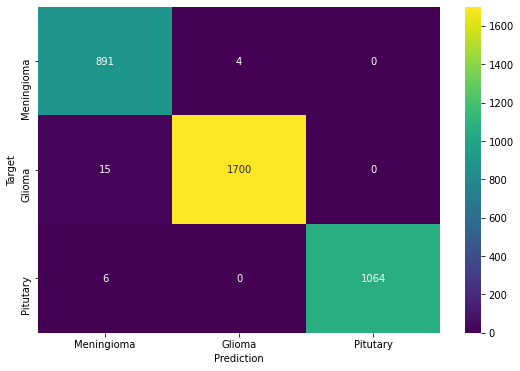

## Dataset

We have used [brain tumor dataset](https://figshare.com/articles/brain_tumor_dataset/1512427) posted by **Jun Cheng** on [figshare.com](figshare.com).

This brain tumor dataset containing 3064 T1-weighted contrast-inhanced images from 233 patients with three kinds of brain tumor: meningioma (708 slices), glioma (1426 slices), and pituitary tumor (930 slices).

## Modules

- [brain_tumor_dataset_preparation.ipynb](brain_tumor_dataset_preparation.ipynb) - For preparation and preprocessing of dataset for training, validation and testing.

- [torch_brain_tumor_classifier.ipynb](torch_brain_tumor_classifier.ipynb) - Contains all the steps, processes and results of training, validating and testing our brain tumor classifier.

- [test.py](test.py) - Script which accepts path to an image as input, which then classifies the image into one of the three classes.

- [deploy.py](deploy.py) - A python script integrated with Flask server, that starts the Web Interface on local server where user can upload MRI image of brain and get classification results.

**Note:** We have included few images for testing under [test_images](test_images) directory.

## Running the classifier

Download the classifier model '.pt' file from this [drive link](https://drive.google.com/file/d/1-rIrzzqpsSg80QG175hjEPv9ilnSHmqK/view?usp=sharing) and place it under a folder named 'models' in the same directory where the files of this repository are present.

- Install dependencies

```python
pip install -r requirements.txt
```

- Use the [test.py](test.py) script for running the script in Terminal, Powershell or Command Prompt.
  `python test.py`

- Use [deploy.py](deploy.py) script to access the classifier as an interactive web interface.
  `python deploy.py`

### Classifier Evaluation

#### Loss Graph


#### Accuracy Graph


#### Confusion Matrix on Test set



### Research Papers

- [Multi-grade brain tumor classification using deep CNN with extensive data augmentation](https://www.sciencedirect.com/science/article/abs/pii/S1877750318307385)

- [A Deep Learning-Based Framework for Automatic Brain Tumors Classification Using Transfer Learning](https://link.springer.com/article/10.1007/s00034-019-01246-3)

- [Deep Residual Learning for Image Recognition (ResNet)](https://arxiv.org/pdf/1512.03385.pdf)
